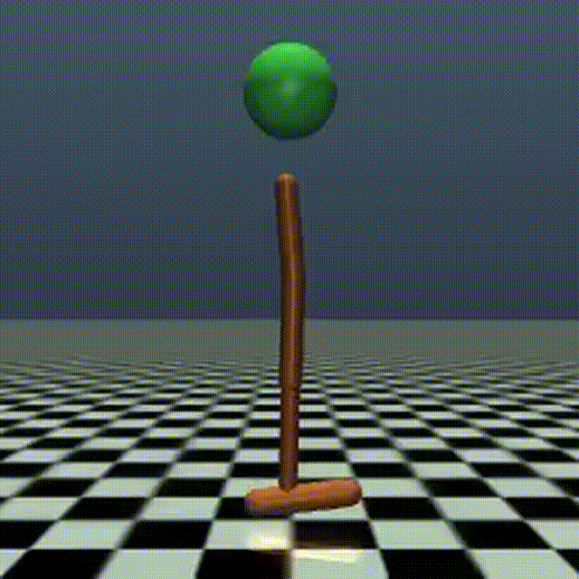
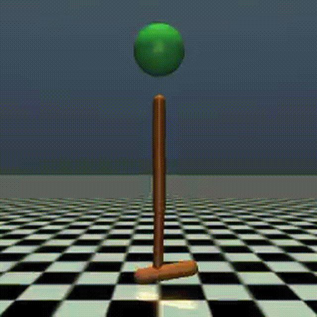
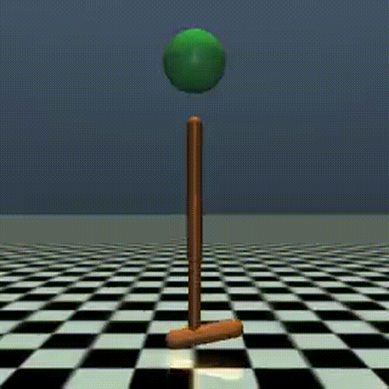

# Off-Policy SafeRL
This project is a demonstration page for the proposed explicit safe reinforcement learning methods. Code might be available in future.


# Safety-Gymnasium Benchmark 
Baseline models were trained based on the implementation of safe reinforcement learning algorithms in the [Omnisafe](https://www.omnisafe.ai/en/latest/) frameowrk.
It should be noted that all data for all baseline models is procured under the constraint of ```cost_limit=25.00```. The proposed method does not include ```cost_limit``` as it try to avoid any constraint violation. Default training limitation is 1e6 steps. 

### 🏀 Safety Status Indicator  
The **ball** represents the system's safety status:  
- 🔴 **Red** → Unsafe  
- 🟢 **Green** → Safe  

## SafetyHopperVelocity-v1

### Demo Video
| DDPG | TD3 | TD3_LAG | TD3_PID | Ours |
|------|-----|---------|---------|------|
|  |  |  |  |  |

#### Reward  
| DDPG | TD3 | TD3_LAG | TD3_PID | Ours |
|------|-----|---------|---------|------|
| 1462.56 ± 591.14 | 3404.41 ± 82.57 | 928.79 ± 389.48 | 1225.97 ± 224.71 | 1216.583 ± 118.336 |

#### Cost  
| DDPG | TD3 | TD3_LAG | TD3_PID | Ours |
|------|-----|---------|---------|------|
| 429.17 ± 220.05 | 973.80 ± 4.92 | 40.67 ± 30.99 | 46.87 ± 65.28 | 1.340 ± 3.803 |
